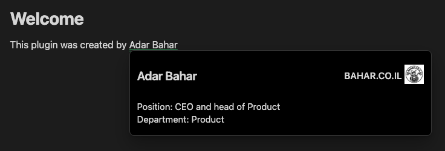

# Obsidian People Metadata

A personal tool for managing and looking up people metadata within your notes.




## Basic usage

1. Create a folder, right-click on the folder in your file explorer, and select `Set people metadata folder`. This registers the folder as your people metadata folder.
2. Within the folder, create metadata files (with any name of your choice).
3. Add a person metadata entry using the `Add a Person` command. This will display a user-friendly modal where you can input the person's details and choose which company they belong to.
4. Once a person metadata entry is added, the person's name should be underlined in your notes. You may preview the metadata by hovering over the underlined name with the mouse, or triggering the `Preview person metadata` command when your cursor is on the name.

### Editor menu

Options available:
- Go to person metadata (jump to metadata of person)
- Add a Person (add a new person to an existing company or create a new company)
- Edit person metadata (right-click on an underlined metadata entry)

### Commands

You may want to assign hotkeys to the commands available for easy access:
- Add a Person
- Refresh people
- Update company colors

## How it works

**Note Metadata** does not maintain any hidden metadata files for your people metadata. 
All metadata entries are placed in your vault and form part of your notes.
You will notice that added metadata entries will create entries within your selected metadata file. 
You may edit these entries freely to add/edit your metadata, but if you do so, make sure to adhere strictly to the metadata rules below.
**It is recommended that you read through the metadata rules first before manually editing the metadata files.**

### Metadata rules

Currently, there are two types of metadata files: `consolidated` and `atomic`.
The type of metadata file is specified in the `def-type` frontmatter (or property) of a file.
For all metadata files you create, the `def-type` frontmatter should be set to either 'consolidated' or 'atomic'.
For compatibility reasons, a file is treated to be `consolidated` if the `def-type` frontmatter is not specified (but this is not guaranteed to remain the same in subsequent releases, so always specify the frontmatter when creating a new metadata file). 
For convenience, use the commands provided to add the `def-type` frontmatter.

#### Consolidated metadata file

A `consolidated` file type refers to a file that can contain many metadata entries for people within the same company.
Register a metadata file by specifying the `def-type: consolidated` frontmatter.

A `consolidated` metadata file is parsed according to the following rules:

1. The **file name** represents the **company name** (e.g., `TechCorp.md` represents TechCorp company).
2. The **frontmatter** can optionally contain a company color setting using the `color` property. You can use either predefined color names (e.g., `color: "blue"`) or hex codes (e.g., `color: "#0066cc"`). This color will be used for the double underline decoration of all people in this company.
3. The **first line** (after frontmatter) can optionally contain a company logo using markdown image syntax (e.g., ``). If the logo image fails to load or is broken, a default logo will be displayed showing the first two letters of the company name.
4. A metadata block consists of a **full name, job position, department, and notes**. They must be provided **strictly** in that order.
4. A full name is denoted with a line in the following format `# <name>`. This is rendered as a markdown header in Obsidian.
5. A job position is specified with a line starting with `Position: `.
6. A department is specified with a line starting with `Department: `.
7. A line that occurs after a registered **full name** and is not a position or department is deemed to be notes. Notes can be multi-line. All subsequent lines are notes until the metadata block divider is encountered. You may write markdown here, which will be formatted similar to Obsidian's markdown formatting.
8. A line with nothing but three hyphens `---` is used as a divider to separate metadata blocks. This is rendered as a delimiting line in Obsidian. (This divider can be configured in the settings to recognise three underscores `___` as well)

Example metadata file (`TechCorp.md`):

> ```
> ---
> def-type: consolidated
> color: "blue"
> ---
>
> 
>
> # John Doe
> Position: Developer
> Department: Engineering
>
> Notes about John Doe.
> These notes can span several lines.
> They will end when the divider is reached.
>
> ---
>
> # Jane Smith
> Position: Manager
> Department: Management
>
> Notice that the last entry in the file does not need to have a divider, although it is still valid to have one.
> ```

### Available Color Names

You can use predefined color names instead of hex codes:

**Primary Colors:** `blue`, `red`, `green`, `orange`, `purple`, `teal`
**Secondary Colors:** `navy`, `crimson`, `forest`, `amber`, `violet`, `cyan`
**Muted Colors:** `slate`, `rose`, `lime`, `indigo`, `pink`, `brown`
**Custom Colors:** `mint`, `coral`, `lavender`, `gold`, `silver`, `bronze`

See [COMPANY_COLORS.md](COMPANY_COLORS.md) for the complete list with color previews.

## Auto-Registration and Template Generation

The plugin automatically handles new files in the People folder in two scenarios:

### When Creating New Files
When you create a new markdown file in the People folder, the plugin will automatically:
1. **Add the required frontmatter** (`def-type: consolidated`)
2. **Apply the "People" label** in the file explorer
3. **Add a basic template** (if the file is empty)

### When Opening Empty Files
When you open an empty markdown file in the People folder, the plugin will automatically:
1. **Detect that it's empty** and lacks People metadata
2. **Add the complete template** with:
   - Page properties (`def-type: consolidated`, `color: "blue"`)
   - Company logo placeholder
   - Example person entries with proper formatting
   - Dividing lines between entries

### Template Structure
```yaml
---
def-type: consolidated
color: "blue"
---


# Person Name
Position: Job Title
Department: Department Name

Notes about this person go here.

---

# Another Person
Position: Another Job Title
Department: Another Department

Notes about the second person.

---
```

This can be disabled in Settings → "Auto-register new files" if you prefer manual control.

#### Atomic metadata file

An `atomic` metadata file refers to a file that contains only one metadata entry.
Register an atomic metadata file by specifying the `def-type: atomic` frontmatter.

An `atomic` metadata file is parsed according to the following rules:
1. The name of the file is the full name of the person
2. The contents of the file (excluding the frontmatter) form the metadata

## Company Logo Fallback

When a company logo image fails to load or is broken, the plugin automatically displays a default logo instead. The default logo shows the first two letters of the company name in a styled badge.

### Features:
- **Automatic detection**: The plugin detects when images fail to load
- **Graceful fallback**: Shows a clean default logo instead of broken image icons
- **Company initials**: Uses the first two letters of the company name (e.g., "TC" for "TechCorp")
- **Consistent styling**: Matches the overall design of the plugin
- **Accessibility**: Includes proper title attributes for screen readers

### How it works:
1. The plugin first attempts to load the specified company logo image
2. If the image fails to load (broken URL, missing file, network error), it automatically replaces it with a default logo
3. The default logo displays the company's initials in a styled badge
4. If no company name is available, it shows "CO" as a generic fallback

This ensures that company information is always displayed consistently, even when logo images are unavailable.

## Add a Person Modal

The "Add a Person" command provides a user-friendly interface for adding new people to your metadata system.

### Features:
- **Intuitive form fields**: Clear labels and helpful placeholders guide you through the process
- **Company selection**: Choose from existing companies or create a new one
- **Automatic file management**: The plugin handles file creation and organization
- **Form validation**: Ensures required information is provided

### Form Fields:
1. **Full Name** (required): The person's complete name (e.g., "John Smith")
2. **Job Title** (optional): Their position or role (e.g., "Dev Team Leader")
3. **Department** (optional): The department they work in (e.g., "Engineering")
4. **Description** (required): Notes and details about the person
5. **Choose Company**: Select an existing company or create a new one

### Company Options:
- **Existing Companies**: The dropdown shows all current companies by name
- **Create a new Company**: Automatically creates a new company file with proper template structure

### How it works:
1. Use the `Add a Person` command or right-click menu option
2. Fill in the person's information
3. Choose a company from the dropdown or select "Create a new Company"
4. Click Save to add the person to the selected company file

When creating a new company, the plugin automatically:
- Generates a company file name based on the person's last name
- Creates the file with proper frontmatter and template structure
- Registers it as a consolidated definition file
- Adds a placeholder logo that will use the default fallback

## Metadata context
> _TLDR:_ "Context" is synonymous with a metadata file. By specifying a context, you specify that you want to use specific metadata file(s) to source your metadata for the current note.

Metadata context refers to the repository of metadata that are available for the currently active note.
By default, all notes have no context (you can think of this as being globally-scoped).
This means that your newly-created notes will always have access to the combination of all metadata defined in your metadata files.

This behaviour can be overridden by specifying the "context" of your note.
Each metadata file that you have is taken to be a separate context (hence your metadata should be structured accordingly).
Once context(s) are declared for a note, it will only retrieve metadata from the specified contexts.
You can think of this as having a local scope for the note.
The note now sees only a limited subset of all your metadata.

### Usage

To add context to your note, you need to manually edit the note's properties.
Add a `def-context` property which is a `List` type containing a list of file paths corresponding to the selected metadata files.

### How it works

Context is specified by adding a `def-context` property to your note's frontmatter.
In source, it will look something like this:
```
---
def-context:
	- metadata/people1.md
	- metadata/people2.md
---
```

You can edit your properties directly using Obsidian's properties panel or by editing the frontmatter in source mode.

### Removing contexts

To remove contexts, simply remove the file path from the `def-context` property.
Or if you want to remove all contexts, you can delete the `def-context` property altogether.

## Refreshing people

Whenever you find that the plugin is not detecting certain people or people files, run the `Refresh people` command to manually get the plugin to read your people files.

## Feedback

I welcome any feedback on how to improve this tool.
Do let me know by opening a Github issue if you find any bugs, or have any ideas for features or improvements.

## Contributing

If you're a programmer and would like to see certain features implemented, I welcome and would be grateful for contributions. If you are interested, please do let me know in the issue thread.
